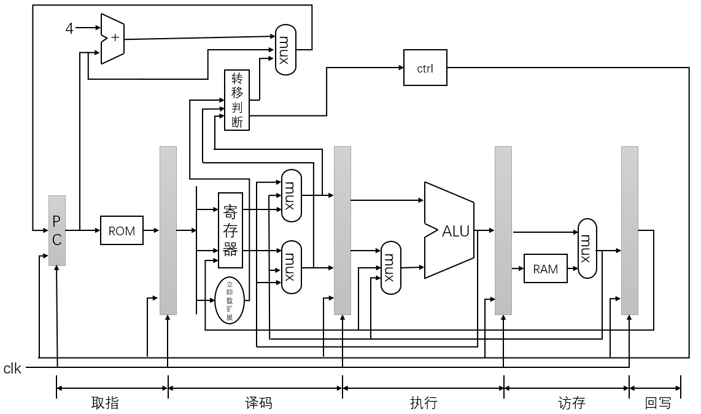
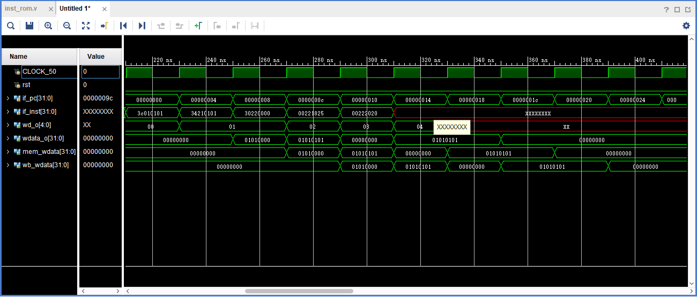
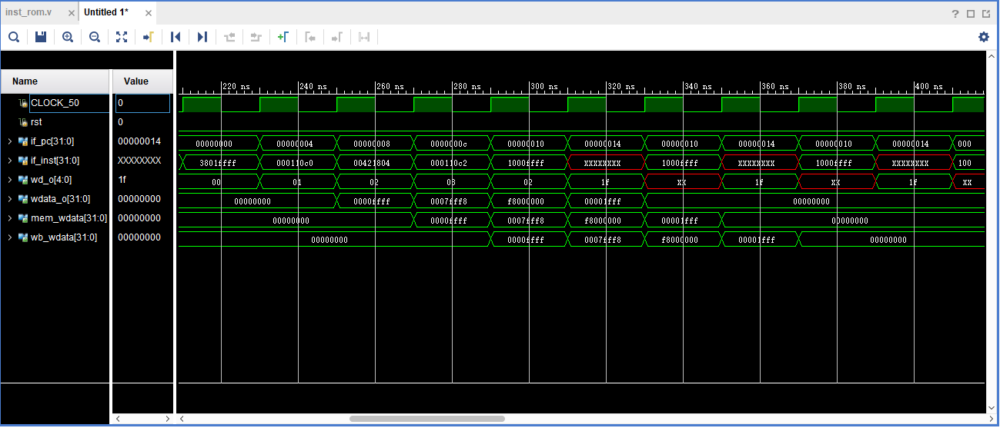
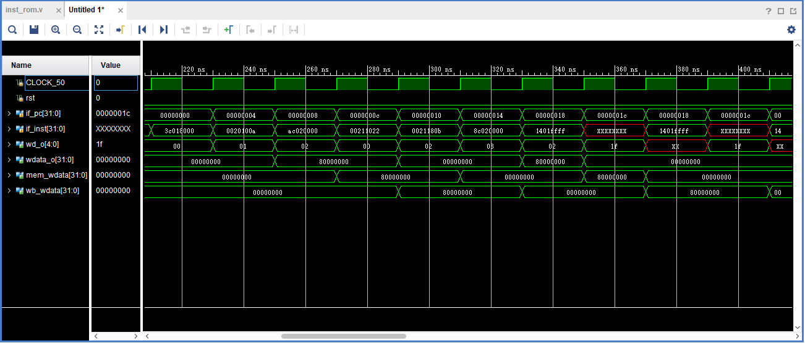

# CPU_TEMP
## 实现指令
在设计中，我们采用vivado软件，我们选择实现MIPS32中的部分指令，共21条，他们分别是：  
* 逻辑操作指令：**and，or，xor，nor，andi，ori，xori，lui**指令；
* 移位操作指令：**sll，sllv，srl**指令；
* 移动操作指令：**movz，movn**指令；
* 算术操作指令：**add，addi，sub**指令；
* 转移指令：**j,beq,bne**指令；
* 加载存储指令：**sw，lw**指令。  
在这些指令中，涉及到除协处理器访问指令和与异常相关的其余指令，通过设计数据通路，将这几条指令实现。
1. 逻辑操作指令
    - and rd，rs,rt  
rd -> rs AND rt,将地址为rs的通用寄存器的值与地址为rt的通用寄存器的值进行逻辑“与”操作，运算结果保存到地址为rd的通用寄存器中。
    - or rd，rs,rt  
rd -> rs OR rt,将地址为rs的通用寄存器的值与地址为rt的通用寄存器的值进行逻辑“或”操作，运算结果保存到地址为rd的通用寄存器中。
    - xor rd，rs,rt  
rd -> rs XOR rt,将地址为rs的通用寄存器的值与地址为rt的通用寄存器的值进行逻辑“异或”操作，运算结果保存到地址为rd的通用寄存器中。
    - nor rd，rs,rt  
rd -> rs NOR rt,将地址为rs的通用寄存器的值与地址为rt的通用寄存器的值进行逻辑“或非”操作，运算结果保存到地址为rd的通用寄存器中。
    - andi rt，rs，immediate  
rt -> rs AND zero_extended(immediate),将地址为rs的通用寄存器的值与指令中立即数进行零扩展后的值进行逻辑“与”运算，运算结果保存到地址为rt的通用寄存器中。
    - ori rt，rs，immediate  
rt -> rs OR zero_extended(immediate),将地址为rs的通用寄存器的值与指令中立即数进行零扩展后的值进行逻辑“或”运算，运算结果保存到地址为rt的通用寄存器中。
    - xori rt，rs，immediate  
rt -> rs XOR zero_extended(immediate),将地址为rs的通用寄存器的值与指令中立即数进行零扩展后的值进行逻辑“异或”运算，运算结果保存到地址为rt的通用寄存器中。
    - lui rt，immediate  
rt-> immediate||0^16，将指令中的16位立即数保存到地址为rt的通用寄存器的高16位。另外，地址为rt的通用寄存器的低16位采用0扩充。
2. 移位操作指令
    - sll rd，rt，sa  
rd-> rt << sa(logic),将地址为rt的通用寄存器的值左移sa位，空出的位置使用0填充，结果保存到地址为rd的通用寄存器中。
    - sllv rd，rt，rs  
rd-> rt << rs[4:0](logic),将地址为rt的通用寄存器的值左移位，空出的位置使用0填充，结果保存到地址为rd的通用寄存器中。移位位数由地址为rs的寄存器值的第0-4bit确定。
    - srl rd，rt，sa  
rd-> rt >> sa(logic),将地址为rt的通用寄存器的值右移sa位，空出的位置使用0填充，结果保存到地址为rd的通用寄存器中。
3. 移动操作指令
    - movz rd，rs，rt  
if rt=0 then rd-> rs，判断地址为rt的通用寄存器的值，如果为0，那么将地址为rs的通用寄存器值赋给地址为rd的通用寄存器；反之，则保持地址为rd的通用寄存器不变。
    - movn rd，rs，rt  
if rt!=0 then rd-> rs，判断地址为rt的通用寄存器的值，如果不为0，那么将地址为rs的通用寄存器值赋给地址为rd的通用寄存器；反之，则保持地址为rd的通用寄存器不变。
4. 算术操作指令
    - add rd，rs，rt  
rd-> rs + rt，将地址为rs的通用寄存器的值与地址为rt的通用寄存器的值进行加法运算，结果保留到地址为rd的通用寄存器中。
    - addi rt，rs，immediate  
rt-> rs + (sign_extended)immediate，将指令中的16位立即数进行符号扩展，与地址为rs的寄存器的值进行加法运算，结果保留到地址为rt的寄存器中。
    - sub rd，rs，rt  
rd-> rs - rt，将地址为rs的通用寄存器的值与地址为rt的通用寄存器的值进行减法运算，结果保留到地址为rd的通用寄存器中。
5. 转移指令
    - j target  
pc-> (pc+4)[31:28]||target||“00”,转移到新的指令地址，新指令地址的低28位是指令中的target左移两位的值，新指令地址的高4位是跳转指令后面延迟槽指令的地址高4位。
    - beq rs，rt，offset  
if rs = rt then branch，其中branch=(signed_extend)(offset||“00”)+(pc+4),将地址为rs的通用寄存器的值与地址为rt的通用寄存器的值进行比较，如果相等，那么发生转移。
    - bne rs，rt，offset  
if rs != rt then branch，其中branch=(signed_extend)(offset||“00”)+(pc+4),将地址为rs的通用寄存器的值与地址为rt的通用寄存器的值进行比较，如果不相等，那么发生转移。
6. 加载存储指令
    - sw rt offset(base)  
将地址为rt的通用寄存器的值存储到内存中的指定位置。
    - lw rt offset(base)  
从内存中指定的加载地址处，读取一个字，保存到地址为rt的通用寄存器中。  
## 整体实现
在设计中，设计采用五段流水线，分别为取值阶段、译码阶段、执行阶段、访存阶段和回写阶段，如图。
 

## 详细实现见文件夹代码

## 测试结果
 
 
 
 

